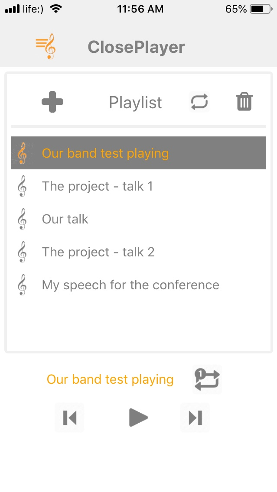
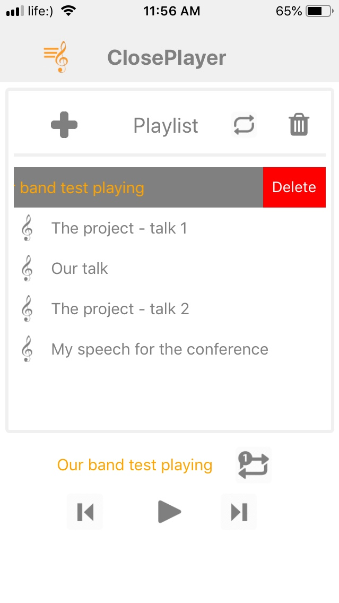
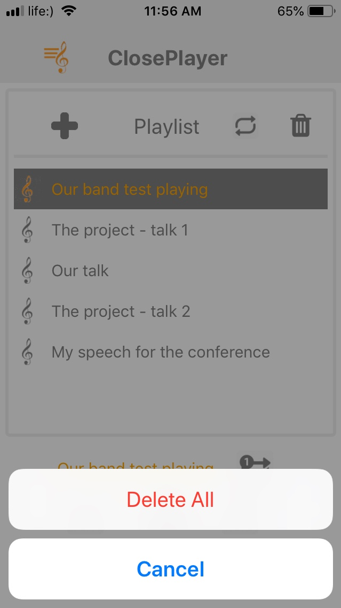

ClosePlayer - audio player for apple store.

Unfortunately it can be published because of
"
This type of app has been identified as one that may violate one or more of the following App Store Review Guidelines. Specifically, these types of apps often:
5.2.3 - Facilitate illegal file sharing or include the ability to save, convert, or download media from third party sources without explicit authorization from those sources
"

Preview:



------



------




### development

Need to remove files in document folder

- .xcodeproj vs .xcworkspace
 Navigate to the ios folder in your project,
 then open the .xcodeproj file, or if you are using CocoaPods open .xcworkspace,
  within it using Xcode.

- export PATH="/Users/yauhenbichel/.npm-packages/bin:$PATH"
- react-native run-ios

- https://www.npmjs.com/package/react-native-sound
    - npm install react-native-sound --save
    - react-native link react-native-sound


- add index.ios.js - copy index.js

- play in background
```
<key>UIBackgroundModes</key>
    <array>
        <string>audio</string>
    </array>
```

- mobile vs simulator
```
NSURL *jsCodeLocation;
      // on my mobile
      //jsCodeLocation = [[NSBundle mainBundle] URLForResource:@"main" withExtension:@"jsbundle"];
      // on simulator
      jsCodeLocation = [[RCTBundleURLProvider sharedSettings]jsBundleURLForBundleRoot:@"index.ios" fallbackResource:nil];
```


- for production
    - remove NSExceptionDomains


- react-native-document-picker
    - npm i --save react-native-document-picker
    - react-native link
    - You need to enable iCloud Documents to access iCloud

- use https://github.com/Elyx0/react-native-document-picker/tree/v3
for supporting multiple files selecting

- using v 3 with private npm pakcage
    - https://docs.npmjs.com/creating-and-publishing-private-packages
    - https://docs.npmjs.com/configuring-your-registry-settings-as-an-npm-enterprise-user#using-npmrc-to-manage-multiple-profiles-for-different-registries


    To install npmrc, on the command line, run
    -    npm i npmrc -g
    -    export PATH="/Users/yauhenbichel/.npm-packages/bin:$PATH"
    -    npmrc -c eugenebichel
    -    npm config set registry https://registry.eugenebichel-registry.npme.io/

    - npm config set registry "https://registry.npmjs.com/"

- No bundle URL present.
  Make sure you’re running a packager server or have included
  a .jsbundle file in your application bundle.

    - set project settings - legacy

    - remove build folder and run-ios again
    - remove for production
    ```
    <key>NSExceptionDomains</key>
    		<dict>
    			<key>localhost</key>
    			<dict>
    				<key>NSExceptionAllowsInsecureHTTPLoads</key>
    				<true/>
    			</dict>
    		</dict>
    ```


    - kill process in 8081
        - lsof -i :8081
        - kill -9 <pid>

    - react-native run-ios --configuration Release

    - react-native bundle --entry-file index.js --platform ios --dev false --bundle-output ios/main.jsbundle --assets-dest ios

- timeout for loading music
https://github.com/zmxv/react-native-sound/issues/89

```

const callback = (error, sound) => {
		if (error) {
			console.warn("callback error");
			console.warn(error);
			return;
		}

		console.warn("callback");
		console.warn(sound);
	};

	return setTimeout(() => {
		let sound = new Sound(url, '', (error) => callback(error, sound));

		setTimeout(() => {
			sound.play((success) => {
				console.warn("sound.play callback");
				sound.release();
			});
		}, 500);

		return sound
	}, 500);

```


- console.warn for displaying console logs

- npm install react-native-fs --save
- react-native link react-native-fs


- npm install --save-dev babel-plugin-module-resolver


- main.jsbundle does not exist

https://github.com/facebook/react-native/issues/15432

his happens when there is no offline bundle file in your project, I had the same problem and this worked for me.

If you're running on the device, check the Running On Device docs

I added the below to my package.json file so I don't have to type it every time I want to generate an offline bundle

"build:ios": "react-native bundle --entry-file='index.ios.js' --bundle-output='./ios/YourAppName/main.jsbundle'
--dev=false --platform='ios' --assets-dest='./'"
And you can run it like this npm run build:ios

You'll see the main.jsbundle file generated inside your ios/YourAppName directory

Next, open your project using XCode, right click on your project name then click Add Files to "YourProjectName",
choose the main.jsbundle file that was generated, and then build again.

That should do it.


react-native bundle --platform ios --assets-dest ./ --dev false --entry-file index.ios.js
--bundle-output ./ios/AudioPlayer/main.jsbundle

When you are generating bundle , Also put --assets-dest ./
"react-native bundle --platform ios --assets-dest ./ --dev false --entry-file index.ios.js --bundle-output
iOS/main.jsbundle"
It will generate main.jsbundle and Assets folder . Go to your Xcode right click add files to project
and add main.jsbundle file to project. Also drag and drop Assets folder and select create by reference
(note: do not select create group).
i was using react 0.33, main.jsbundle is using assets(small a) folder but generating Assets(Caps A).
 I just changed the generated folder from Assets to assets and import it to xcode and it start working

--------------------------

Realm is not supporting node v11.0 yet

node v = 10.13.0
npm install -g node@10.13.0

brew install node@10

nvm install 10 --reinstall-packages-from=node

- yarn add react-native-queue / npm i --save react-native-queue
- react-native link realm realm@2.19.1
- yarn add react-native-background-task / npm i --save react-native-background-task
- react-native link react-native-background-task
- yarn add react-native-background-fetch@2.0.x / npm i --save react-native-background-fetch@2.0.x
- react-native link react-native-background-fetch


react-native: export PATH="/Users/yauhenbichel/.npm-packages/bin:$PATH"
node: export PATH="/usr/local/opt/node@10/bin:$PATH"
export PATH="/usr/local/opt/node@10/bin:$PATH" >> ~/.bash_profile
nvm: . ~/.nvm/nvm.sh

-------------
nvm use node
nvm alias default node
-------------

node@10 is keg-only, which means it was not symlinked into /usr/local,
because this is an alternate version of another formula.

If you need to have node@10 first in your PATH run:
  echo 'export PATH="/usr/local/opt/node@10/bin:$PATH"' >> ~/.bash_profile

For compilers to find node@10 you may need to set:
  export LDFLAGS="-L/usr/local/opt/node@10/lib"
  export CPPFLAGS="-I/usr/local/opt/node@10/include"

------------

npm install --save react-native-modal

-------------

yarn add react-native-background-timer / npm i --save react-native-background-timer
react-native link

--------------

npm install --save utf8

-------------

npm install --save react-native-swipeout

-------------
