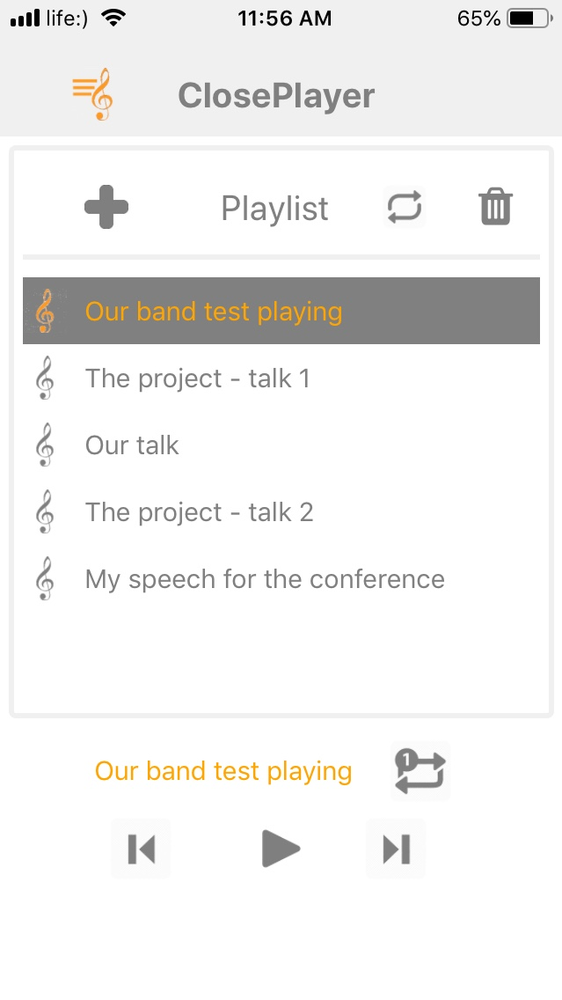

# ClosePlayer

A small, calm audio player for the files already on your phone. Add songs from
the device or a cloud drive, play them as a playlist, repeat one or all. That is
the whole app, on purpose.

It was written in 2019 as an iOS app and **now runs on Android** (React Native
0.87, New Architecture). Apple rejected it at review under guideline 5.2.3,
which covers apps that save media from third-party sources; a player for a
person's own local files is an ordinary Android app.



## What it does

- **Add** one or more audio files through the Android system picker, which also
  reaches Google Drive and other document providers. Each file is copied into
  the app's own storage.
- **Play** the playlist with previous / play-stop / next. Previous and next wrap
  around at the ends.
- **Repeat one** loops the current song; **repeat all** loops the playlist.
- **Background playback** with a media notification and lock-screen controls,
  so music keeps playing with the screen off.
- **Delete** a song with the trash icon on its row, or everything with the trash
  icon in the playlist header (it asks first).
- The playlist is not kept between launches, as in the original app.

## Running it

Node 22, JDK 17 or 21, and the Android SDK (platform 37 is fetched by Gradle).

```bash
npm install          # also applies patches/ (see below)
npm start            # Metro, in one terminal
npm run android      # build, install and launch on a device or emulator
```

A standalone APK, JavaScript bundled inside:

```bash
cd android && ./gradlew assembleRelease
# android/app/build/outputs/apk/release/app-release.apk
```

The release build is signed with the debug keystore from the template. Before
publishing, sign it with your own upload key.

## Before a real release

- **AdMob.** `app.json` and `src/config.js` hold Google's public *test*
  identifiers, so development builds only ever show test ads. Put your own AdMob
  app IDs in `app.json` and your banner unit in `src/config.js`. If the banner
  cannot load, it hides itself rather than leaving an empty box.
- **iOS** was regenerated from the React Native template, with background
  audio enabled in `Info.plist`, but has not been built or run since the
  upgrade. It needs `pod install` and a check on a device.

## How it is built

| | |
|---|---|
| `App.js` | The screen: playlist, controls, repeat and delete. |
| `src/services/player.js` | The only code that configures the player: set-up, repeat mode, wrap-around skip. |
| `src/services/playbackService.js` | Handles the notification and lock-screen buttons, even with no screen open. |
| `src/services/files.js` | Picks files, copies them into `records/`, deletes them. |

Playback is [react-native-track-player](https://github.com/doublesymmetry/react-native-track-player)
4.1.2, which is the right tool for background audio on Android (a foreground
media service) but predates the New Architecture. `patches/` fixes the three
things that stop it working on React Native 0.87, applied automatically on
install by patch-package:

1. two nullability errors that stop it compiling against 0.87;
2. its asynchronous methods returned a coroutine `Job`, which the TurboModule
   interop rejects, so the whole module failed to load;
3. it reached for `reactNativeHost` to send events, which throws under the New
   Architecture; it now uses the service's own `reactContext`.

CI builds the APK on every pull request, so a missing patch or a broken build
shows up there rather than on a phone.

## Tests

```bash
npx jest
```

The unit tests pin the two bugs that only showed up on a real device: picking
several files at once lost every file after the first (they share one copy
folder, and it was deleted too early), and "next" before anything had played
did arithmetic on `undefined`. Putting either bug back makes its test fail.

## Contributors

Thank you to everyone who has helped.

<!-- readme: contributors,bots/- -start -->
<p align="center">
  <a href="https://github.com/YauhenBichel" title="Yauhen Bichel" aria-label="Yauhen Bichel"></a>
</p>
<p align="center"><em>The contributor's wall proudly displays the achievements of one dedicated individual.</em></p>
<!-- readme: contributors,bots/- -end -->

Filled from GitHub commits (bots omitted). Live demo: [readme-contributors](https://github.com/YauhenBichel/readme-contributors#live-demo).
